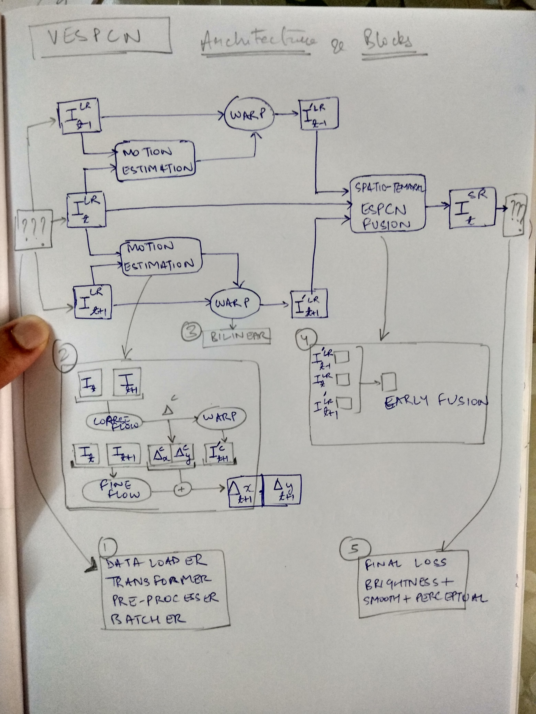

# Super Resolution, On The Edge, For The Win!
*by Akshay Chawla and Priyam Tejaswin*

Main reference paper : [Real-Time Video Super-Resolution with Spatio-Temporal Networks and Motion Compensation, CVPR 2017](http://openaccess.thecvf.com/content_cvpr_2017/papers/Caballero_Real-Time_Video_Super-Resolution_CVPR_2017_paper.pdf)
```
.
├── README.md
├── papers ## PDFs for review and reference (not committed).
├── src_tensorflow ## Code in tf (using `tensorflow.keras`). 
└── src_tf2 ## Code in tf2_alpha.
```

## Dependencies
- `src_tensorflow` uses **tensorflow 1.13.1**. This is the latest stable release as of creating this repository.
- `src_tf2` uses **tensorflow 2.0** which is still an alpha build.

## System Design


## [Gotchas](https://en.wikipedia.org/wiki/Gotcha_(programming))
### `tf.image.extract_image_patches`
Training data is generated by extracting high-res patches from the source image which are then downscaled and fed to the network as input.
Lo and behold -- TF already has a utility for this!! 
The catch? It dumps all the patches to the `depth` dimension.
By default, [TF uses channels last](https://www.tensorflow.org/guide/performance/overview#data_formats), and all APIs are designed for this.

While [tf.image.extract_image_patches](https://www.tensorflow.org/api_docs/python/tf/image/extract_image_patches) has a simple API, it's output was not intuitively interpretable.

Consider the following 6x6 "image" defined in 2 channels with the *channels last* format : `[batch, height, width, channels]`. 
To visualise the height,width in a channel, we simply select all values in the appropriate dims for the first channel : `[0, :, :, 0]`. 
Below we can see the intesnsities for both channels:
```python
>>> img = np.arange(36 * 2).reshape([1, 6, 6, 2])
>>> print img[0, :, :, 0]
[[ 0  2  4  6  8 10]
 [12 14 16 18 20 22]
 [24 26 28 30 32 34]
 [36 38 40 42 44 46]
 [48 50 52 54 56 58]
 [60 62 64 66 68 70]]
 
>>> print img[0, :, :, 1]
[[ 1  3  5  7  9 11]
 [13 15 17 19 21 23]
 [25 27 29 31 33 35]
 [37 39 41 43 45 47]
 [49 51 53 55 57 59]
 [61 63 65 67 69 71]]
```

Applying `tf.image.extract_image_patches` with `ksizes=[1, 4, 4, 1], strides=[1, 2, 2, 1], rates=[1, 1, 1, 1], padding='VALID'` gives the following:
```python
>>> patches = tf.image.extract_image_patches(
    img, 
    ksizes=[1, 4, 4, 1], 
    strides=[1, 2, 2, 1], 
    rates=[1, 1, 1, 1], 
    padding='VALID'
)
>>> print patches.numpy().shape
(1, 2, 2, 32) ## wut?
```
- Our channels have increased to 32.
- Height and Width have become 2.
- The first 4x4 patch in the first channel should have been
```python
[[ 0  2  4  6]
 [12 14 16 18]
 [24 26 28 30]
 [36 38 40 42]]
```
- Where are my patches?

Here's how you interpret the output.
- Given the image dims, the kernel size and the stride, we should end up with 4 filters per channel.
- The *height* and *width* in the output (2x2) are actually the patch coordinates: `[0, 0]` is the first patch, `[0, 1]` the second, and so on.

Let's look at the first patch...
```python
>>> print patches[0, 0, 0].numpy()
[ 0  1  2  3  4  5  6  7 12 13 14 15 16 17 18 19 24 25 26 27 28 29 30 31
 36 37 38 39 40 41 42 43]
```
This has 32 numbers -- our patch should be of size 4x4, for both channels; the total should 32 values. This matches.
How about reshaping this in that format:
```python
>>> print patches[0, 0, 0].numpy().reshape([4, 4, 2])
[[[ 0  1]
  [ 2  3]
  [ 4  5]
  [ 6  7]]

 [[12 13]
  [14 15]
  [16 17]
  [18 19]]

 [[24 25]
  [26 27]
  [28 29]
  [30 31]]

 [[36 37]
  [38 39]
  [40 41]
  [42 43]]]
```
Ah, now, we simply visualise the patches like the image in the beginning : `[:, :, i]`, for the `ith` channel.
```python
>>> print patches[0, 0, 0].numpy().reshape([4, 4, 2])[:, :, 0]
[[ 0  2  4  6]
 [12 14 16 18]
 [24 26 28 30]
 [36 38 40 42]]
 
>>> print patches[0, 0, 0].numpy().reshape([4, 4, 2])[:, :, 1]
[[ 1  3  5  7]
 [13 15 17 19]
 [25 27 29 31]
 [37 39 41 43]]
```
And voila! Its the patch that we were expecting!

## References
- VESPCN implementation (unofficial, TF) - <https://github.com/LoSealL/VideoSuperResolution/blob/master/VSR/Models/Vespcn.py>
- Fully-featured TF2 implementation of YOLOv3 (for checking TF2 oddities) - <https://github.com/zzh8829/yolov3-tf2>